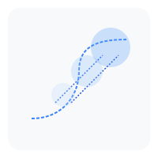

# 

<p align="center">
  
</p>

<h1 align="center">Anthology of the SOTA</h1>

<p align="center">
  Best practices for ML/AI training, validated by research and experience
</p>

---

Why we -- AI/ML researchers and practitioners -- do the things that we do, and why we do those things the way that we do them.

You might also be interested in my list of significantly impactful works that has more of a historical perspective: https://github.com/dmarx/anthology-of-modern-ml

The main difference here is that where that prior list was focused on big, impactful works, including those which no longer reflect best practice, this list is focused entirely on whatever the current best practice is understood to be and explaining the justification behind that design choice. Where my `Modern ML` anthology focused on paradigm shifts and made no space for important but comparatively "small" (with respect to paradigmatic impact) incremental improvements, I expect this space to be dominated by incremental works. Additional, because the other list operates as a kind of "hall of fame", it generally should not experience churn. This list however, I plan to maintain as a living document with an "attic" in which to deprecate former best practices that have been supplanted.
## Development Guidelines

### Code Organization for LLM Interaction

When developing this project (or using it as a template), keep in mind these guidelines for effective collaboration with Large Language Models:

1. **File Length and Modularity**
   - Keep files short and focused on a single responsibility
   - If you find yourself using comments like "... rest remains the same" or "... etc", the file is too long
   - Files should be completely replaceable in a single LLM interaction
   - Long files should be split into logical components

2. **Dependencies**
   - All dependencies managed in `pyproject.toml`
   - Optional dependencies grouped by feature:
     ```toml
     [project.optional-dependencies]
     test = ["pytest", ...]
     site = ["markdown2", ...]
     all = ["pytest", "markdown2", ...]  # Everything
     ```
   - Use appropriate groups during development:
     ```bash
     pip install -e ".[test]"  # Just testing
     pip install -e ".[all]"   # Everything
     ```

3. **Testing Standards**
   - Every new feature needs tests
   - Write tests before starting on new features to formalize expected behavior (i.e. TDD)
   - Tests should be clear and focused
   - Use pytest fixtures for common setups
   - All workflows depend on tests passing
   - Test files should follow same modularity principles
   - Use `pytest` fixtures for common setups
   - Keep tests focused and well-documented

4. **Why This Matters**
   - LLMs work best with clear, focused contexts
   - Complete file contents are better than partial updates with ellipsis
   - Tests provide clear examples of intended behavior
   - Shorter files make it easier for LLMs to:
     - Understand the complete context
     - Suggest accurate modifications
     - Maintain consistency
     - Avoid potential errors from incomplete information

5. **Best Practices**
   - Aim for files under 200 lines
   - Each file should have a single, clear purpose
   - Use directory structure to organize related components
   - Prefer many small files over few large files
   - Consider splitting when files require partial updates

6. **Project Conventions**
   - Use `loguru` for all logging
   - Use `fire` for CLI interfaces
   - use `omegaconf` for yaml
   - Prefer `pathlib` for file system operations
   - Type hints should use:
     - Built-in generics over typing module (PEP 585)
     - Union operator (`|`) over Optional (PEP 604)
   - Github Actions is the only available runtime for script execution
   - All workflows depend on tests passing
   - Syntax permitting, all files should begin with a comment detailing the current file's name and relative path within the project
<p align="center">
  <svg width="200" height="200" viewBox="0 0 200 200" xmlns="http://www.w3.org/2000/svg">
    <!-- Background -->
    <rect x="10" y="10" width="180" height="180" rx="15" fill="#f8f9fa"/>
    
    <!-- Phase diagram -->
    <g transform="translate(40,30)">
      <!-- Transition boundaries -->
      <path d="M0,120 C40,120 60,90 60,60 S80,20 120,20"
            fill="none"
            stroke="#3b82f6"
            stroke-width="2"
            stroke-dasharray="4 2"/>
            
      <!-- Emergence regions -->
      <path d="M30,100 L90,40"
            stroke="#2563eb"
            stroke-width="1.5"
            stroke-dasharray="2 2"/>
      <path d="M50,100 L110,40"
            stroke="#1d4ed8"
            stroke-width="1.5"
            stroke-dasharray="2 2"/>
            
      <!-- Capability regions -->
      <circle cx="40" cy="90" r="15" fill="#bfdbfe" fill-opacity="0.3"/>
      <circle cx="70" cy="60" r="20" fill="#93c5fd" fill-opacity="0.3"/>
      <circle cx="100" cy="30" r="25" fill="#60a5fa" fill-opacity="0.3"/>
    </g>
  </svg>
</p>

<h1 align="center">Anthology of the SOTA</h1>

<p align="center">
  Best practices for ML/AI training, validated by research and experience
</p>

---
# ML Training Topics Organization

## Topic Structure

### 1. training-optimization
Consolidates training-related performance and methodology
- Previously covered by:
  - training-efficiency
  - training-dynamics
  - large-batch-training
  - optimization
  - scaling-laws
- Scope:
  - Learning rate schedules
  - Batch size optimization
  - Training dynamics monitoring
  - Optimization algorithms
  - Scaling strategies
  - General performance metrics

### 2. systems-optimization
Hardware and software system optimizations
- Previously covered by:
  - hardware-optimization
  - compilation
  - systems
- Scope:
  - Hardware utilization
  - Kernel optimization
  - Compilation strategies
  - Memory access patterns
  - System-level performance

### 3. model-stability
Model training stability and initialization
- Previously covered by:
  - training-stability
  - initialization
  - normalization (partially)
- Scope:
  - Initialization techniques
  - Normalization methods
  - Gradient handling
  - Training stability monitoring
  - Loss landscape analysis

### 4. distributed-optimization
Distributed training and memory management
- Previously covered by:
  - distributed-training
  - memory-efficiency
  - checkpointing
- Scope:
  - Distribution strategies
  - Memory management
  - Checkpointing
  - Communication optimization
  - Resource allocation

### 5. data-pipeline
Data handling and quality
- Previously covered by:
  - data-loading
  - data-quality
- Scope:
  - Data loading optimization
  - Quality assessment
  - Pipeline efficiency
  - Data preprocessing
  - Batch preparation

### 6. attention-techniques
Attention mechanism implementations
- Previously covered by:
  - attention
  - attention-alternatives
- Scope:
  - Attention variants
  - Implementation optimizations
  - Alternative mechanisms
  - Memory efficiency

### 7. model-architecture
Model-specific architectural patterns
- Previously covered by:
  - transformers
  - nlp
  - MoE
- Scope:
  - Architecture patterns
  - Component design
  - Model-specific optimizations
  - Structural choices

## Naming Conventions

1. **Format**: hyphenated-lowercase
   ```
   good: training-optimization
   bad: TrainingOptimization, training_optimization
   ```

2. **Process Topics**: Use gerund (-ing) form
   ```
   good: training-optimization, model-scaling
   bad: train-optimization, scale-models
   ```

3. **Component Topics**: Use noun form
   ```
   good: model-architecture, attention-techniques
   bad: modeling-architecture, attending-techniques
   ```

4. **Standard Suffixes**:
   - `-optimization`: Performance-focused topics
   - `-techniques`: Methodology-focused topics
   - `-architecture`: Structural topics
   - `-pipeline`: Process flow topics

## Migration Guide

1. **Recommendation Tagging**:
   - Each recommendation should be tagged with exactly one primary topic
   - Can have additional secondary topic tags if needed
   - Use most specific applicable topic

2. **Topic Metadata**:
   - Each topic should have:
     - Clear scope definition
     - Parent topic (if applicable)
     - Related topics
     - Key references

3. **Implementation Steps**:
   1. Create new topic structure
   2. Map existing recommendations to new topics
   3. Update all recommendation tags
   4. Add metadata to topics
   5. Review for consistency

## Topic Maintenance Rules

1. **Adding New Topics**:
   - Must follow naming conventions
   - Must have clear, non-overlapping scope
   - Must include scope definition and metadata
   - Should fit within existing hierarchy

2. **Merging Topics**:
   - Required when scope overlap exceeds 50%
   - Must migrate all recommendations
   - Must update all references

3. **Splitting Topics**:
   - Required when topic becomes too broad
   - Must have clear dividing criteria
   - Should maintain naming consistency

4. **Deprecating Topics**:
   - Mark as deprecated with reason
   - Migrate or archive recommendations
   - Maintain historical record
