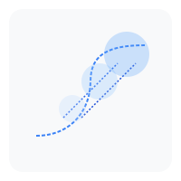

<p align="center">
  
</p>

<h1 align="center">Anthology of the SOTA</h1>

<p align="center">
  Best practices for ML/AI training, validated by research and experience
</p>

---

Why we -- AI/ML researchers and practitioners -- do the things that we do, and why we do those things the way that we do them.

You might also be interested in my list of significantly impactful works that has more of a historical perspective: https://github.com/dmarx/anthology-of-modern-ml

The main difference here is that where that prior list was focused on big, impactful works, including those which no longer reflect best practice, this list is focused entirely on whatever the current best practice is understood to be and explaining the justification behind that design choice. Where my `Modern ML` anthology focused on paradigm shifts and made no space for important but comparatively "small" (with respect to paradigmatic impact) incremental improvements, I expect this space to be dominated by incremental works. Additional, because the other list operates as a kind of "hall of fame", it generally should not experience churn. This list however, I plan to maintain as a living document with an "attic" in which to deprecate former best practices that have been supplanted.
## Project Structure

```

├── .github
│   └── workflows
│       ├── build-readme.yaml
│       ├── build_registry.yml
│       ├── deploy-frontend.old
│       ├── deploy-frontend.yaml
│       ├── deploy-frontend.yaml.react
│       ├── docs.yml
│       ├── generate-package-lock.yaml.old
│       ├── generate_summaries.yaml
│       ├── render_svg.yaml
│       └── test.yml
├── .gitignore
├── CLAUDE.md
├── LICENSE
├── README.llm
├── README.md
├── README_LLM.md
├── assets
│   └── logo.svg
├── assets.logo.svg
├── data
│   ├── REGISTRY.md
│   ├── registry.yaml
│   └── research.yaml
├── docs
│   ├── README.md
│   ├── decisions
│   │   ├── README.md
│   │   └── tags
│   │       ├── mechanism.md
│   │       ├── migration.md
│   │       ├── record.md
│   │       └── taxonomy.md
│   ├── design-principles.md
│   ├── readme
│   │   ├── base.md.j2
│   │   └── sections
│   │       ├── introduction.md.j2
│   │       ├── registry.md.j2
│   │       └── structure.md.j2
│   ├── readme_llm
│   │   ├── base.md.j2
│   │   └── sections
│   │       ├── development.md.j2
│   │       └── registry_naming_conventions.md.j2
│   └── record.md
├── luria.toml
├── pyproject.toml
├── record
│   ├── changelog.d
│   │   ├── 20260824-adopt-luria-record.md
│   │   └── _template.md
│   ├── curation.d
│   │   ├── 2026
│   │   │   └── 08
│   │   │       └── 24
│   │   │           └── 192746.md
│   │   └── _template.md
│   ├── decisions.d
│   │   ├── ADR-001.md
│   │   ├── ADR-002.md
│   │   ├── ADR-003.md
│   │   ├── ADR-004.md
│   │   ├── ADR-005.md
│   │   ├── ADR-006.md
│   │   ├── README.stub
│   │   ├── _template.md
│   │   └── tags.yaml
│   └── principles.d
│       ├── DP-001.md
│       ├── DP-002.md
│       ├── DP-003.md
│       ├── _template.md
│       └── tags.yaml
├── src
│   └── scripts
│       ├── generate-package-lock.js
│       ├── generate_summaries
│       │   ├── __init__.py
│       │   ├── __main__.py
│       │   ├── generator.py
│       │   ├── signature_extractor.py
│       │   └── special_summaries.py
│       ├── migration
│       │   ├── __init__.py
│       │   ├── to_record.py
│       │   └── topic_map.yaml
│       ├── readme_generator.py
│       ├── registry
│       │   ├── __init__.py
│       │   ├── cli.py
│       │   ├── identifiers.py
│       │   ├── io.py
│       │   ├── recommendations.py
│       │   └── types.py
│       └── utils.py
├── tests
│   ├── conftest.py
│   ├── registry
│   │   ├── test_identifiers.py
│   │   ├── test_io.py
│   │   └── test_recommendations.py
│   └── test_generate_readme.py
└── web
    ├── index.html
    ├── scripts
    │   └── main.js
    └── styles
        └── main.css

```
